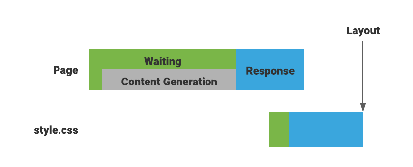
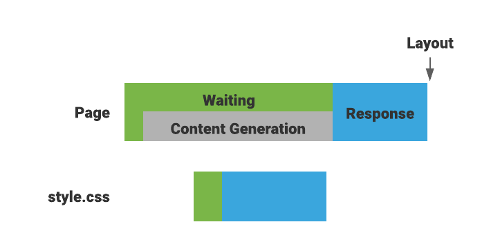

# HTTP 103 Early Hints
May, 2021

## Author

bashi@chromium.org

## Introduction

[103 Early Hints](https://datatracker.ietf.org/doc/html/rfc8297) is an informational HTTP status code. Servers can send 103 responses with some hints that help a client to make preparations for the final response.

## Motivation

HTTP 103 Early Hints can be used to optimize page rendering speed by specifying `link rel=preload` HTTP header fields. When a server needs to take some time to prepare for the content of the page and the server knows the content needs subresources such as stylesheets, the server can send a 103 response with `link rel=preload` to ask a client to preload the subresources, before sending the final response. See [Example use case](#example-use-case) section for more details.

Web developers can also send 103 responses that convey [Resource Hints](https://w3c.github.io/resource-hints/) such as “preconnect” and “prefetch”.

## Goals

The primary motivation is to provide a way for web developers to optimize page rendering speed by allowing servers to send hints for critical subresources before the final response.

## Non-goals

103 responses don't ensure a client to handle hinted header fields. A client may preload when `link rel=preload` is specified but it doesn't have to preload, as the [RFC specifies](https://datatracker.ietf.org/doc/html/rfc8297#section-2).

## Example use case

Let's say the content of a page is as follows:
```html
<!DOCTYPE html>
<html>
<head>
  <link href="style.css" rel="stylesheet"> 
</head>
<body>
  <!-- ... (the server needs to "think" to generate the content) ... -->
</body>
</html>
```

The server can include `link rel=preload` in the final response so that the client can start loading `style.css` as soon as the headers are received, before parsing the HTML body.
```
HTTP/1.1 200 OK
Link: <style.css>; rel="preload"; as="style"
Content-Type: text/html; charset=utf-8

<!DOCTYPE html>
...
```

Unfortunately this does not always work effectively. Depending on the result of content generation the response could be 404, or the response needs additional header fields. In that case the server has to wait for content generation.



Here is where a 103 response comes in. If the server knows that the content likely needs `style.css` the server can send a 103 response to ask the client to preload `style.css`.

```
HTTP/1.1 103 Early Hints
Link: <style.css>; rel="preload"; as="style"

HTTP/1.1 200 OK
Link: <style.css>; rel="preload"; as="style"
Content-Type: text/html; charset=utf-8

<!DOCTYPE html>
...
```



Time to finish rendering the page could be improved when preloading `style.css` finished earlier.

## Fetch and HTML integration

Currently there is no integration with the [Fetch](https://fetch.spec.whatwg.org/), [HTML](https://html.spec.whatwg.org/multipage/) and/or [Preload](https://w3c.github.io/preload/). We plan to work on the followings.

* The Fetch standard needs to be updated so that [HTTP-network fetch](https://fetch.spec.whatwg.org/#http-network-fetch):
  * Doesn’t ignore 103 responses.
  * Can [queue a fetch task](https://fetch.spec.whatwg.org/#queue-a-fetch-task) for hinted preload fetches.
* The HTML and/or Preload specs need to refer to the RFC from relevant sections. For example, we might add an [appropriate time](https://w3c.github.io/preload/#dfn-appropriate-times) to fetch linked resources in [the Processing section](https://w3c.github.io/preload/#processing) of Preload.

Tracking issue: https://github.com/whatwg/fetch/issues/1225

## Extension to the PerformanceResourceTiming

We also consider exposing whether resources are preloaded by 103 responses via the PerformanceResourceTiming interface so that web developers can measure the impact of preloads triggered by 103 responses. See [the spec issue](https://github.com/w3c/resource-timing/issues/273) for discussion.

```js
const entry = performance.getEntriesByName("https://example.com/early-hints-preloaded.css")[0];
console.log(entry.initiatorType); // => "early-hints"
```

## References

* [Chrome Platform Status](https://chromestatus.com/feature/5207422375297024)
* https://www.fastly.com/blog/beyond-server-push-experimenting-with-the-103-early-hints-status-code
* https://www.fastly.com/blog/faster-websites-early-priority-hints
